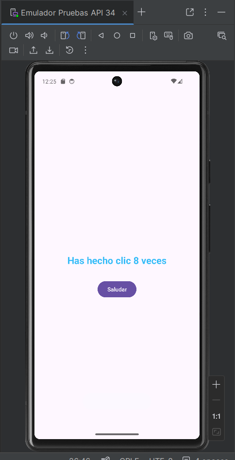
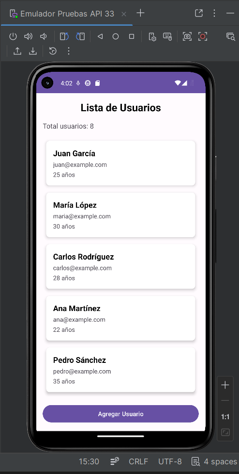
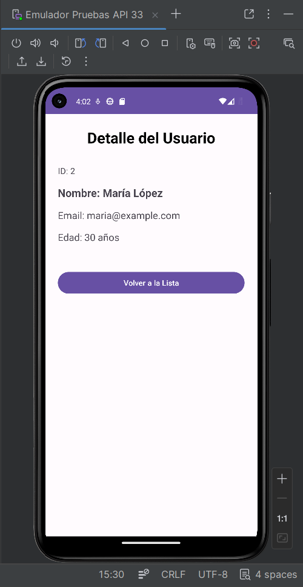

 Taller 1 - Hello Android

- Nombre: Karol Liliana Jaimes Orduz
- Código: E193

 Respuestas

 1. Función del AndroidManifest.xml
Es el archivo que configura la aplicación Android. Define las actividades, permisos y componentes necesarios para que la aplicación funcione.

 2. Diferencia entre activity_main.xml y MainActivity.kt
activity_main.xml define la interfaz gráfica de la aplicación.  
MainActivity.kt contiene la lógica y comportamiento de la aplicación.

 3. Gestión de recursos en Android
Android administra la memoria y los procesos del dispositivo. Cuando hay pocos recursos, el sistema puede pausar o cerrar aplicaciones en segundo plano para mantener el rendimiento.

 4. Aplicaciones famosas que usan Kotlin
- Pinterest
- Netflix
- Trello

 Capturas de Pantalla

 Taller 2 - Arquitectura MVVM

 Respuestas a Preguntas Conceptuales

 1. ¿Qué problema resuelve el ViewModel en Android?
Permite mantener y gestionar los datos de la interfaz incluso cuando ocurren cambios de configuración como la rotación de pantalla.

 2. ¿Por qué LiveData es "lifecycle-aware" y qué beneficio trae?
Porque solo envía actualizaciones cuando el componente está activo, evitando errores y consumo innecesario de recursos.

 3. Explica con tus propias palabras el flujo de datos en MVVM
La Vista observa al ViewModel, el ViewModel obtiene datos del Repository y cuando cambian los datos se actualiza la Vista.

 4. ¿Qué ventaja tiene usar Fragments vs múltiples Activities?
Permiten reutilizar partes de la interfaz y manejar mejor la navegación dentro de una misma actividad.

 5. ¿Cómo ayuda el Repository Pattern a la arquitectura?
Centraliza el acceso a los datos y separa la lógica de datos de la interfaz.

 Capturas de Pantalla

Taller 3 - Lista de Tareas con Fragments, Persistencia y Recordatorios

Qué se implementó
- Lista de tareas con RecyclerView para agregar y editar tareas
- Persistencia local con SharedPreferences y Gson
- BroadcastReceiver con AlarmManager para recordatorios
- Navegación entre Fragments con Navigation Component

Opción de recordatorio utilizada
Se utilizó la Opción A: Notificación local. Al guardar una tarea con recordatorio activado, se muestra una notificación en la barra de estado después de 30 segundos.

